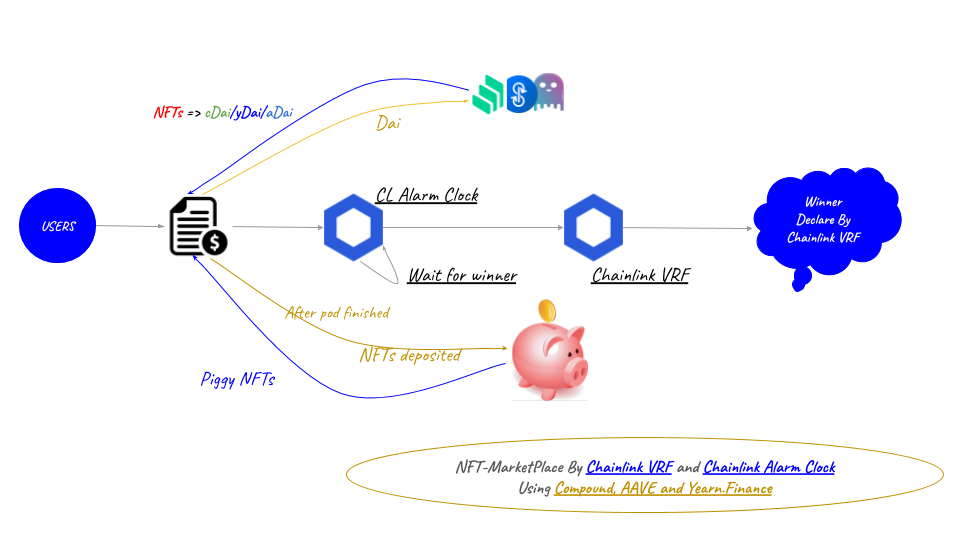
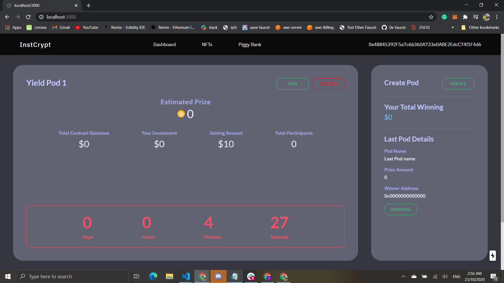
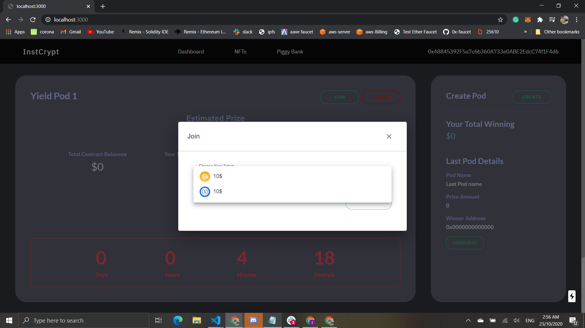
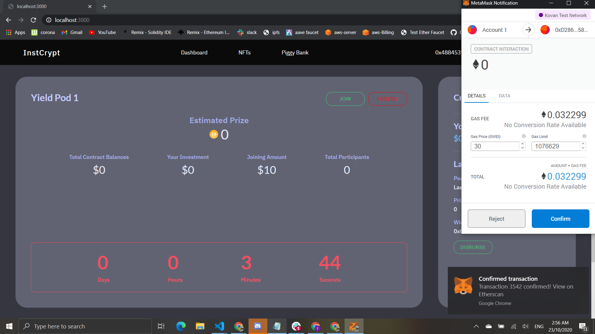
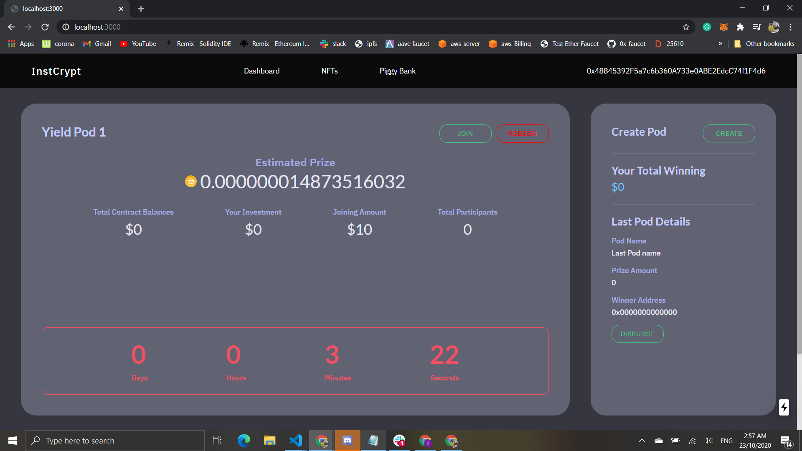
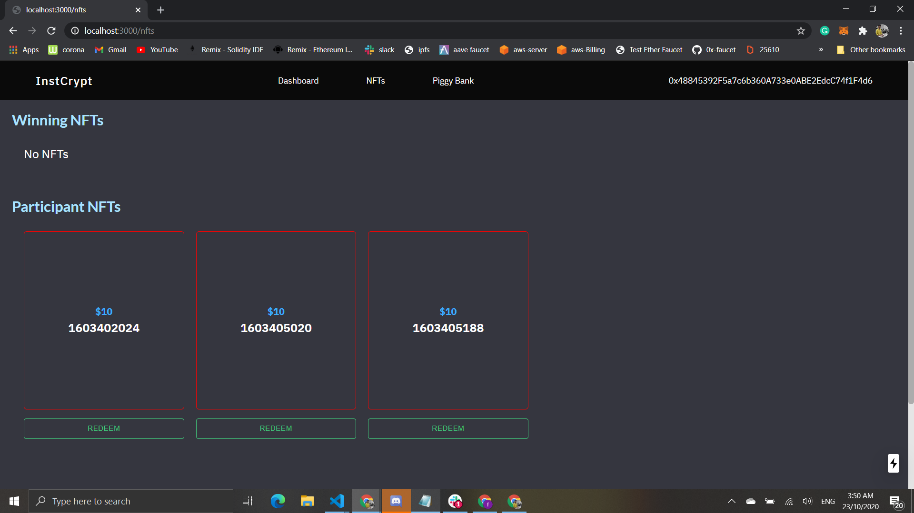
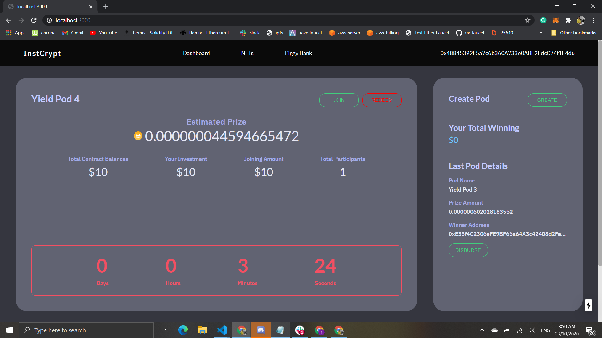
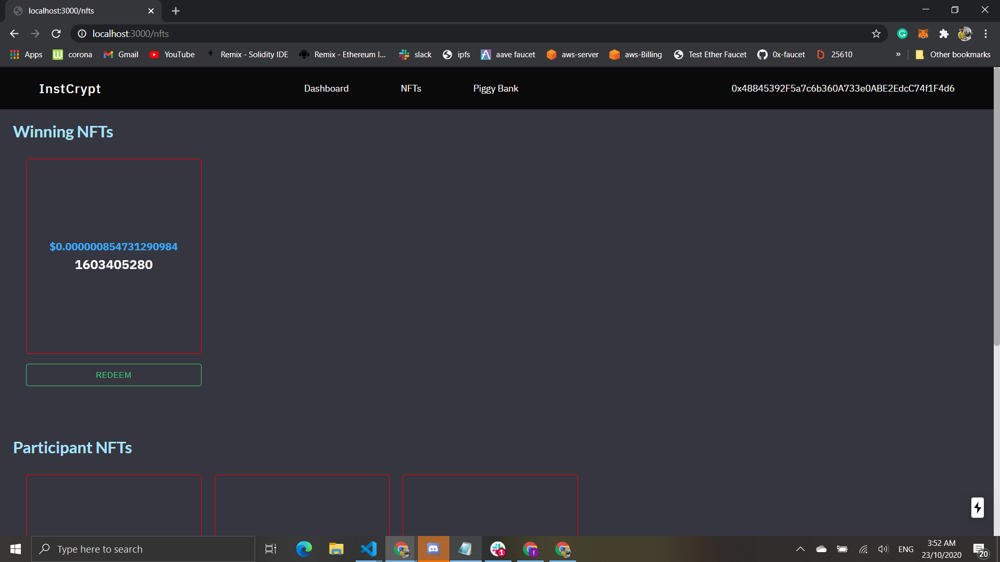
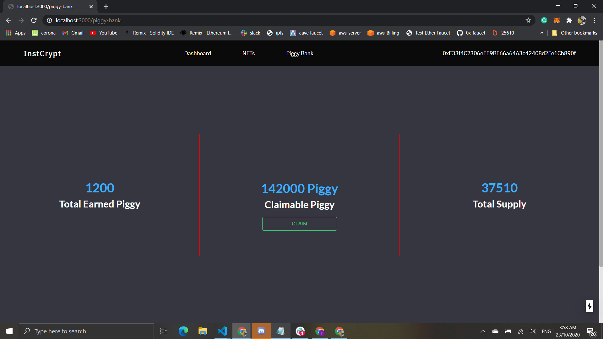

# InstCryp(Automated-NFT-Marketplace)  

```
InstCryp creates a NFT MarketPlace using different legos of defi blockchian. like,

1). no-loss and crypto saving platform to win interest NFT.  
2). different yield stratergy(Compound, AAVE and yearn) for your NFT.  
3). Chainlink Alarm clock and VRF to support defi automation and randomness on NFT.  
4). developed PiggBank protocol which is NFT yield-farming like sushiswap.   
```
## Video Demo

https://youtu.be/LKC2qWUtutI  
[](https://youtu.be/LKC2qWUtutI "InstCryp")

### How can we Participate in InstCryp?  

    1). Automatic InstCryp-POD

`Pod is created by admin with predefined time and users comes to pod and deposit tokens to pod and it will earn interest on all users crypto tokens from lending protocols.`

Users comes to platform Initially and deposit the `DAI or USDC` token in POD and as a credit a user will get `stablecoin backed participant NFTs`. 

Pod will deposit all tokens on lending protocols to earn interest and when predefined time completes then `chainlink alarm clock` verifies and stops all operation of pod and declare winner automatically using `chainlink-VRF` among all particiapants.

Pod will create a `Interest-NFT` as a winnig prize which is backed by generated interest and send to POD-Winner.  
    
    2). NFT Yield-Farming Time with PiggyBank 

Whatever NFTs generate in InstCryp-POD smart contract transfer all the `participant and Interest NFTs` to `PiggyBank`.

`PiggyBank is the yield -famring protocol like sushiswap. where platform deposit your all NFTs on PiggyBank and generate piggy Token backed NFTs as a reward.`

Even if someone doesn't win the prize pool, they could collect the participation NFTs and then when they amass a certain number (say 10), they could earn piggy token backed NFTs on the platform.

Even Interest-NFTs can also use for further to earn reward piggy-NFTs using PiggyBank. 

### Why NFTs?
    a). Every NFTs will be backed by different amount of stablecoin tokens.  
    b). By the collection of NFTs the platform can measure the user's engagement with platform.  
    c). By user's measurement, platform can maintain future reward distribution plans.  

### Governance
To change in protocol we will use compound-governance smart contract which is used to decide the change in any stratergy protocol(like Winning starteregy, yield stratergy, farming startergy, blocks per reward startergy etc.).

### Other Features

1). Single Winner or Multiple Winner startergy  
2). Yield-startergy (compound || AAVE| yearn)  
3). Governance
4). Yield-Farming like sushiswap 
5). Redeem single NFT or Redeem all NFTs for stablecoin

### How to run  
1). Clone repo `https://github.com/sunnyRK/ethonline-submission.git`  
2). cd ethonline-submission  
3). npm install  
4). node server.js  
5). Currently deployed on Kovan Network

### ScreenShots with guidelines


#### 1. Create POD by contract owner 
  


#### 2. Join Pod by users with Stablecoin and user will get stablelcoin backed NFTs



#### 3. Joining pod with metamask 



#### 4. You can see live interest generating from lending protocol and timer is running



#### 5. Aftre depositing stablecoin user will get stablecoin backed NFTs.


#### 6. You can see left side last pod is finised and amount is disbursed to winner address with interest NFT.


#### 7. You can see Interest NFT as a winner prize to winner.


#### 8. After pod finished smart contract automatically transfer NFTs and funds to PiggyBank contract which is yield farming like sudhiswap and generate piggyt-token NFTs at every block.

`Even if someone doesn't win the prize pool, they could collect the participation NFTs and then when they amass a certain number (say 10), they could earn piggy token backed NFTs on the platform.` 



### Tech Stack
1). Compound  
AAVE  
Yearn  
Chainlink Alarm Clock  
Chainlink VRF  
NFTs  
Ethereum  
React-JS  
    


